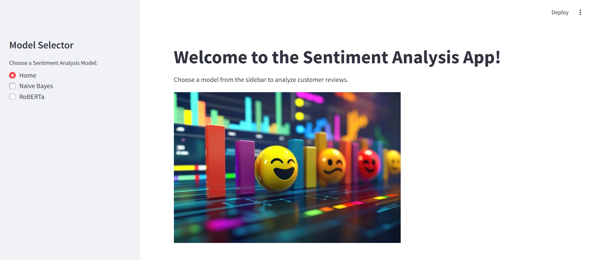
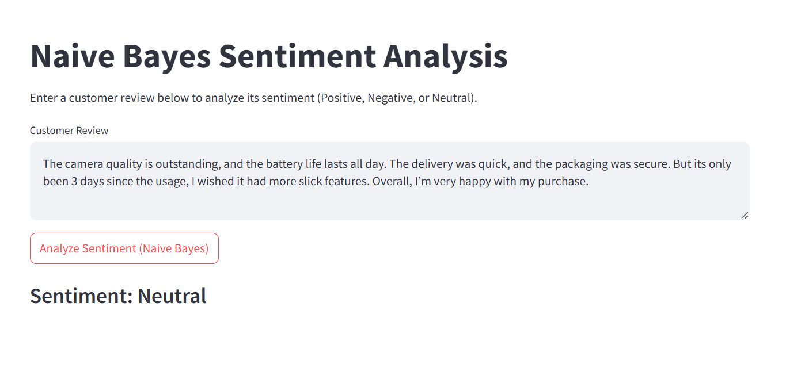
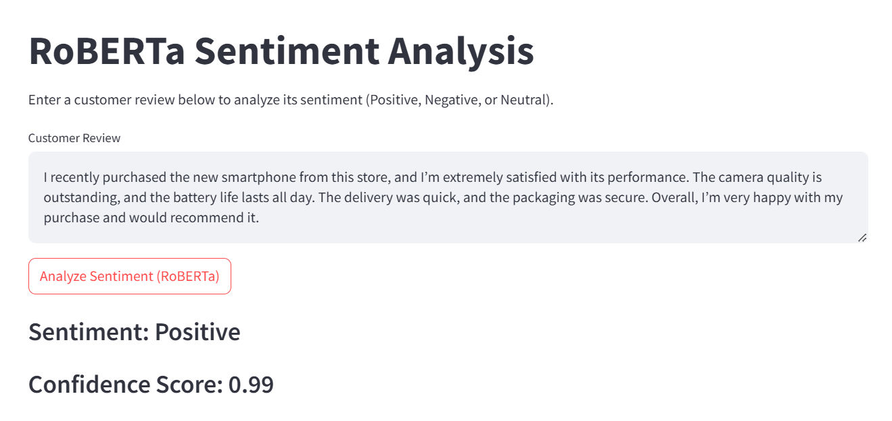

# 📊 Sentiment Analysis on Amazon Reviews

This project is a web-based **Sentiment Analysis App** that allows users to analyze sentiment in Amazon product reviews using two models:

- 🧠 **Naive Bayes** (a traditional ML model)
- 🤖 **RoBERTa** (a transformer-based language model)

Built using **Streamlit**, this interactive app showcases how classical ML compares with modern LLMs on a real-world dataset.

---

## 📌 Project Features

- 📂 Dataset: Amazon Reviews CSV (text and sentiment labels)
- 🔘 Model Selection: Choose between Naive Bayes and RoBERTa from the sidebar
- 📈 Output: Displays predicted sentiment and confidence score (RoBERTa)
- ⚡️ Lightweight UI using Streamlit for easy deployment

---

## 🖼️ App Preview

### 🔘 Home - Model Selector

Users can choose a sentiment analysis model from the sidebar.



---

### 🤓 Naive Bayes Sentiment Analysis

Simple and fast prediction using TF-IDF and MultinomialNB.



---

### 🚀 RoBERTa Sentiment Analysis

State-of-the-art NLP with high confidence sentiment prediction.



---

## 🛠 Tech Stack

- **Frontend**: Streamlit
- **Models**:
  - Naive Bayes (TF-IDF vectorized text)
  - RoBERTa from HuggingFace Transformers
- **Libraries**: `scikit-learn`, `pandas`, `numpy`, `transformers`, `streamlit`, `pickle`

---

## ⚙️ How to Run Locally

1. Clone the repository:
   ```bash
   git clone https://github.com/yourusername/sentiment-analysis-app.git
   cd sentiment-analysis-app
Install dependencies:

```
pip install -r requirements.txt
```

Run the Streamlit app:
```
streamlit run app.py
```

# Comparison

| Feature              | Naive Bayes | RoBERTa           |
| -------------------- | ----------- | ----------------- |
| Accuracy             | Moderate    | High              |
| Speed                | Very Fast   | Moderate          |
| Interpretability     | Easy        | Complex           |
| Confidence Score     | ❌ Not shown | ✅ 0.99 (shown)    |
| Deployment Readiness | ✅ High      | ✅ High (with GPU) |


# 📌 Conclusion
This project demonstrates how modern transformer-based models like RoBERTa outperform classical models in capturing the nuances of natural language, while Naive Bayes still holds value for quick, interpretable results.

# 📄 License
This project is open-source and available under the MIT License.
